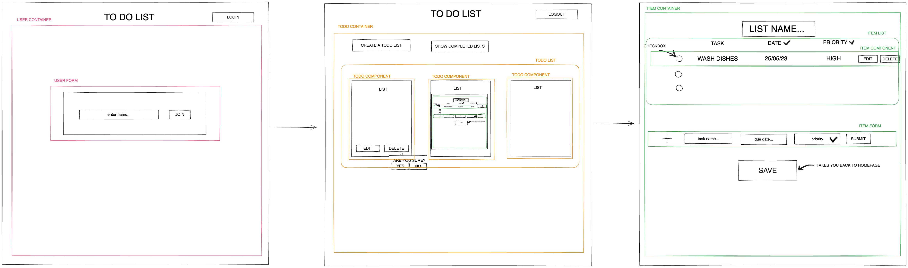

# CheckMate: Keep calm and check it off!

This is a front-end development of a back-end To-Do list API that contains a User List and task Item object. In this project we've used 

## Back end

The back-end uses a User object with a User containing an ID, a name and a list object, each user can create multiple lists 
The Item object has a task name, a due date, a ‘completion’ boolean and a priority enum which was created separately. 
The List is a DTO that has an id, takes a UserId, an item ID and also has boolean for completion.

## Front end 

The front-end uses a User container, a List container and an Item container that are rendered at the press of a button. This wireframe displays the ccomponent relationships and also a rendering of our anticipated product. 

## Set up Instructions: 

Ensure the following are installed on your machine:
IntelliJ (JDK 17) - with Maven
Visual Studio Code
PostgresSQL
Postman
Postico

Fork the repository in GitHub by clicking Fork in the top-right corner of the page. Fill out the details and then press Create fork. This ensures you can make changes without changing the original project. 
Clone the forked repository from GitHub from using the Code button on the forked respository page. Make sure that SSH is selected and copy the link into your terminal inside your selected working directory pathway. Then within your terminal, in the working directory where you want the cloned directory, type the git clone command and paste the copied URL and press Enter. You can open the project by typing the command code . in your terminal. 
Create a new database anywhere in your terminal using: createdb todolist_db
In your terminal (within the frontend_shop_project_client/src that should be opened in Visual Studio Code), perform the following command: npm install or npm i to install node modules.
